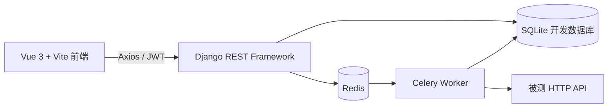

# God - 接口自动化测试与项目协作平台

一个面向团队协作的 Web 接口自动化测试平台。用户可以在项目中维护接口、环境和测试用例，发起单条或批量异步执行，并查看每一次实际请求、响应、断言结果和批次报告。

> 当前仓库面向本地开发与演示。生产部署仍需补充生产级安全配置、数据库和进程托管方案，详见“生产部署说明”。

## 核心能力

- JWT 注册、登录、自动刷新令牌、个人资料和修改密码。
- 项目管理、归档和三层项目角色：拥有者、成员、查看者。
- 项目成员管理：添加、移除、修改角色和搜索。
- 接口定义管理：请求方法、路径、请求头、Query 参数和请求体。
- 环境管理：基础地址、JSON 变量、默认环境和停用。
- 测试用例管理：关联接口和环境，定义期望状态码、请求参数和断言。
- 单条测试执行与完整执行记录：真实请求、响应、断言失败和系统错误均可追溯。
- Redis + Celery 异步批量执行：支持 1 至 20 条用例、再次执行、状态轮询和报告。
- 项目内列表的服务端分页与关键词搜索。

## 系统架构



前端通过 Axios 调用 Django REST API。单条执行由后端同步创建并执行；批量执行将批次任务提交到 Redis，Celery Worker 在后台逐条执行用例并把结果写入数据库，前端通过轮询读取批次状态和执行记录。

## 技术栈

| 层级 | 技术 |
| --- | --- |
| 前端 | Vue 3、Vite、Vue Router、Pinia、Element Plus、Axios |
| 后端 | Python、Django、Django REST Framework、Simple JWT |
| 异步执行 | Celery、Redis |
| 数据库 | SQLite（开发环境） |
| 测试 | pytest、pytest-django |
| API 文档 | drf-spectacular / Swagger UI |

## 项目结构

```text
God/
├── God/             # Django 全局配置、URL、分页和 Celery 应用
├── users/           # 用户、认证、个人资料与密码修改
├── projects/        # 项目、成员关系和角色权限
├── interfaces/      # 接口定义
├── environments/    # 执行环境与变量
├── testcases/       # 测试用例
├── executions/      # 单次执行、批量执行、Celery 任务与报告
├── frontend/        # Vue 单页应用
├── requirements.txt # Python 依赖
└── .env.example     # 后端环境变量模板
```

## 本地启动

### 1. 前置条件

- Python 3.13 或兼容版本。
- Node.js 20 或更高版本与 npm。
- Redis 服务。

### 2. 启动后端

在项目根目录执行：

```powershell
py -m venv .venv
.\.venv\Scripts\Activate.ps1
py -m pip install -r requirements.txt
Copy-Item .env.example .env
py manage.py migrate
py manage.py runserver
```

后端默认运行在 `http://127.0.0.1:8000`，API 文档位于 `http://127.0.0.1:8000/api/docs/`。

### 3. 启动 Redis 与 Celery

另开两个终端。先启动 Redis：

```powershell
redis-server
```

再在已激活虚拟环境的项目根目录启动 Celery。Windows 开发环境使用 `solo` 池：

```powershell
.\.venv\Scripts\celery.exe -A God worker -l info -P solo
```

Redis 地址及结果后端地址可以在 `.env` 中配置：

```env
CELERY_BROKER_URL=redis://127.0.0.1:6379/0
CELERY_RESULT_BACKEND=redis://127.0.0.1:6379/1
```

### 4. 启动前端

在新的终端进入 `frontend` 目录：

```powershell
npm install
npm run dev
```

前端默认运行在 `http://127.0.0.1:5173`。

## 测试与构建

后端测试：

```powershell
py -m pytest
```

后端配置检查：

```powershell
py manage.py check
py manage.py makemigrations --check --dry-run
```

前端生产构建：

```powershell
Set-Location frontend
npm run build
```

## 环境变量

不要提交 `.env`、`db.sqlite3`、Redis 持久化文件或本地学习笔记。仓库提供 `.env.example` 作为模板：

```env
DJANGO_SECRET_KEY=replace-with-a-long-random-secret
CELERY_BROKER_URL=redis://127.0.0.1:6379/0
CELERY_RESULT_BACKEND=redis://127.0.0.1:6379/1
CORS_ALLOWED_ORIGINS=http://127.0.0.1:5173,http://localhost:5173
```

## 生产部署说明

当前配置使用 `DEBUG=True` 和 SQLite，仅适合本地开发。正式部署前至少需要：

1. 通过环境变量关闭 `DEBUG`，设置强随机 `DJANGO_SECRET_KEY` 和正确的 `ALLOWED_HOSTS`。
2. 将 SQLite 更换为 PostgreSQL 等生产数据库，并完成备份策略。
3. 使用 Gunicorn/Uvicorn、Nginx 和 HTTPS 提供 Django 服务；构建并托管前端静态文件。
4. 使用受管理的 Redis 和进程管理器或容器编排持续运行 Celery Worker。
5. 按实际域名收紧 CORS 配置，并补充日志、监控和错误告警。

## 许可

当前未声明开源许可证。未经仓库所有者授权，请勿用于生产或再分发。
